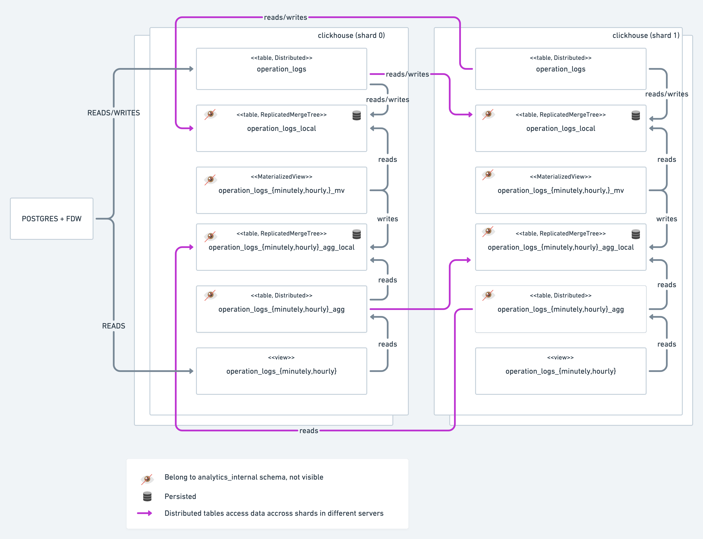

# Distributed clickhouse

Sets up standalone zookeeper to coordinate a clickhouse cluster consisting of
  - two shards
  - two replicas per shard
  - postgres with [clickhouse foreign data wrapper](https://github.com/adjust/clickhouse_fdw)

## How To Use

### Setting up the schema

`script/setup` will:

- Use docker compose to setup the cluster
- Load the schema as per `sql/create.sql`
- Load the data as per `sql/insert.sql`

The container names (and main listening ports) for the cluster nodes are:

- clickhouse-s0-r0 (9000)
- clickhouse-s1-r0 (9001)
- clickhouse-s0-r1 (9002)
- clickhouse-s1-r1 (9003)
- zookeeper (2181)

To connect to clickhouse, you can execute the following command:

```bash
$ bash script/ch-connect {servername} [option]
```

where servername is any of the `clickhouse-s{\d}-r{\d}` listed above.

### Generating and loading data

To generate ready-to-ingest CSV data for the schema, run:

```
script/generate-data
```

```
Options:
	--table: table to populate defaults to `operation_logs`
	--output-dir: defaults to `/tmp/output`
	--rows: number of rows to fill in, defaults to 200,000
	--batch_size: defaults to 100,000, each file will contain that much records. rows/batch_size files will be generated.
	--projects: number of different projects filling data, defaults to 10
	--queries: number of different queries issued, defaults to 100
	--rps: number of requests with the same timestamp, defaults to 1000
	--debug: verbose output, defaults to false. Set to true to enable
```

By default, 200,000 rows will be generated by 10 different projects, using a random sample of 100 queries.

To load data generated using `script/generate-data`, run

```
script/load_data [--input=file_pattern]
```

```
Options:
	--input: file pattern describing csv files, defaults to `tmp/output/*.csv`
```

the csv files need to have been generated by `script/generate-data`, or follow "table_name-*.csv" format.

Examples:

`script/load_data --f` Will load every csv in that directory
`script/load_data /tmp/output/operation_logs_r500000000_b5000000_s15000001.csv` Will load a particular csv

## PoC schema



This is subject to vary, but in essence, postgres serves as a front-end for a clickhouse cluster of 2 shards, two replicas each
in which there are two schemas `analytics`, and `analytics_internal`. `analytics` contains tables and views accessed directly by
the clients connected through the postgres front-end, and `analytics_internal` definitions of materialized views with intermediate
representations of the data.

## Container bootstrap process

1. Start zookeeper
1. Start all clickhouse nodes except clickhouse-s0-r0
1. Start clickhouse-s0-r0 (9000) and load [db-init-scripts/clickhouse/init-db.sql](db-init-scripts/clickhouse/init-db.sql) to create distributed tables and data
1. Start postgres and load [db-init-scripts/postgres/init-db.sql](db-init-scripts/postgres/init-db.sql) to enable the FDW and import the remote schema

## License

WTFPL

